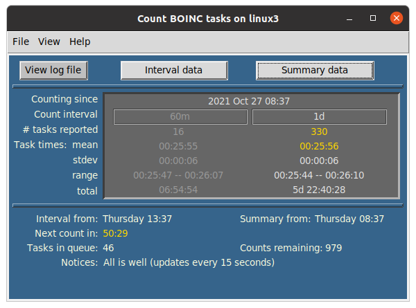

# countBOINCtasks

## count-tasks

A utility for monitoring task data reported by the boinc-client. 
It may be useful for comparing task productivity between different computers or configurations.

Developed with Python 3.8, under Ubuntu 20.04, Windows 10 and Mac OS 10.13. You
 may need to download or update to Python 3.6 or later. Recent Python
  packages can be downloaded from https://www.python.org/downloads/.

### Usage:  
Download the .zip package from the Code download button and extract to your
 favorite folder. From within the resulting countBOINCtasks-master folder
 , open a Terminal or Command Prompt window and call up the utility's help menu. The exact invocation on the command line may slightly differ depending on how your PATH environment variable is set.
<ul>
<li>Linux or Mac OS: `./count-tasks --help`  or `python3 count-tasks`</li>
<li>Windows: `python count-tasks` --help</li>
</ul>
Depending on your Python path settings in Windows, double-clicking on 
the count-tasks file icon may automatically launch the program, with its 
default settings, in a Terminal window.

Default settings assume a default location of the BOINC folder from the
 BOINC installer. If you have put the BOINC folder in a different location,
  then there will be a command line option to enter that custom path to run
   boinc-client's boinccmd (or boinccmd.exe) executable. A custom command
    path can also be added to the countCFG.txt configuration file to avoid
     entering the path on the command line.
```
~/countBOINCtasks-master$ ./count-tasks --help
usage: count-tasks [-h] [--about] [--log {yes,no}] [--interval M] [--summary TIMEunit] [--count_lim N]

optional arguments:
  -h, --help          show this help message and exit
  --about             Author, copyright, and GNU license
  --log {yes,no}      Create log file of results or append to existing log (default: yes)
  --interval M        Specify minutes between task counts (default: 60)
  --summary TIMEunit  Specify time between count summaries, e.g., 12h, 7d (default: 1d)
  --count_lim N       Specify number of count reports until program exits (default: 1008); 0 provides current data

```
Options can be abbreviated, e.g., `./count-tasks --l --i 15 --s 1h --c 12`

Running the default settings (no optional arguments), will count the
 number of tasks reported to the BOINC Project server on a repeating
  interval of 1 hour, with summaries provided every 24 hr. Basic statistics
   for task times are also provided for each count interval. The initial
    data report provided immediately upon program launch is for the most recent
     tasks reported by boinc-client during the past hour. Repeating
      counts intervals begin after the initial report (see TIP, below).

Example report results, using default settings:

```
:~/CountBOINCtasks-master$ ./count-tasks
2021-Jul-21 06:14:14; Number of tasks in the most recent BOINC report: 11
                      Task Time: mean 00:19:25, range [00:13:14 - 00:21:05],
                                 stdev 00:02:11, total 03:33:43
                      Total tasks in queue: 35
                      Number of scheduled count intervals: 1008
                      Counts every 60m, summaries every 1d
Timed intervals beginning now...

2021-Jul-21 07:14:18; Tasks reported in the past 60m: 12
                      Task Time: mean 00:20:29, range [00:18:47 - 00:24:41],
                                 stdev 00:01:33, total 04:05:48
                      Total tasks in queue: 30

1007 counts remaining until exit.
13m ||||||||||< ~time to next count
```

A countdown timer displays, in a colored bar, the approximate time remaining until the next task count.
 
Running with the `--log` option will save data to the log file in the
 working folder. This file is appended to or created when the program is
  launched.

You can let `count-tasks` run in an open terminal window with negligible
 impact on system resources. Stop it with *Ctrl-C* or let it stop
  automatically.  With default settings, it will stop after 6 weeks (1008
   1hr count cycles). A different count cycle limit can be set with the
    `--count_lim` option.

NOTE: Summary counts may be less than the sum of individual counts because
 of persistence of reported tasks between count intervals. This can be
  expected when the `--interval`option is set to less than the default 60
   (minutes). The boinc-client command that provides reported task data
   , `boinccmd  --get_old_tasks`, retrieves tasks reported for the past hour
   , independent of the utility's count interval. To avoid missing any
    reported tasks, the `--interval` option has a 60 minutes maximum count
     interval.

TIP: To get only the most recent task count and time metrics without
 running count intervals, run:  `count-tasks --c 0`

### The GUI version: gcount-tasks
Download and run as described under Usage, but launch the program with these Terminal 
commands from within the parent folder:
<ul>
<li>for Linux or Mac OS: <code>./gcount-tasks</code> -or- <code>python3 gcount-tasks</code></li>
<li>for Windows: <code>python gcount-tasks</code></li>
</ul>

For a brief description and version number, use the `--about` command line option.

Added features in the GUI version:
<ul>
<li>View the log file in a pop-up window.</li>
<li>Backup the log file.</li>
<li>Tally, view, and save task counts that have been recorded in the log file.</li>
<li>Pop-up Help menu.</li>
</ul>



### Stand-alone versions (no Python installation needed!)
#### gcount_tasks.exe - Windows
A **Windows** standalone of gcount-tasks is available. Download and extract the GitHub distribution package as outlined above. Inside the `CountBOINCtasks-master/Standalone_distributables` folder is `GcountTasks_win.zip`, which is an archived folder of files necessary for running the Windows executable. Alternatively, this distributable archive can be downloaded directly from  https://github.com/csecht/CountBOINCtasks/blob/master/Standalone_distributables/GcountTasks_win.zip. Select 'Extract All' for the downloaded ZIP file. Within the extracted GcountTasks folder is the executable, `gcount-tasks.exe` (the .exe extension may not show, depending on your system view settings). Double-click `gcount-tasks.exe` to launch. You will likely first need to permit Windows to open it: from the pop-up warning, click on "more info", then follow the prompts to open the program. The `GcountTasks` folder can be placed anywhere; you may want to create a shortcut of `gcount-tasks.exe` and place it in a convenient location. The `GcountTasks_win` distributable was created with `py2exe` from https://pypi.org/project/py2exe/   

Instructions for how to create your own stand-alone from the gcount-tasks script are in Standalone_distributables/setup_README.txt.

#### GcountTasks.app - MacOS
A **MacOS** standalone of gcount-tasks is available. Download and extract the GitHub distribution package as outlined above. Inside CountBOINCtasks-master/Standalone_distributables folder is `GcountTasks_mac.app.zip`. Unzip that (just double click and follow the prompts) to install the `GcountTasks.app` program, which you can place where you like. Alternatively, the distributable app can be downloaded directly from https://github.com/csecht/CountBOINCtasks/blob/master/Standalone_distributables/GcountTasks_mac.app.zip. `GcountTasks.app` was created with `py2app` from https://pypi.org/project/py2app/

The first time you try to open the app, however, you will get a message saying it can't be opened. Click "Cancel", go into System Preferences > Security & Privacy, click the "Open anyway" button, then "Open". It does not open initially because it was not downloaded from the Apple Store or from a recognized Apple developer. 

The process of opening apps from unrecognized Apple developers can be somewhat streamlined by re-establishing (as of MacOS Sierra) the "Allow apps downloaded from: Anywhere" option in Security & Preferences. Do this with the following command line in the Terminal: `sudo spctl --master-disable`. Using the Finder 'Open' command directly on the unzipped app in its folder, can also somewhat reduce the hassle of navigating through System Preferences; once that is done, then any alias to the app should work smoothly. With any of these "fixes", you will, initially and appropriately, be prompted by the MacOS Gatekeeper to open the app. 

### Development Plans
* Wait for user feedback...

### Known Issues
* Versions 0.4.10 - 0.4.12 were prone to freezes. 

* BOINC version 7.16.14 for Mac OSX. released 1 Dec 2020, has a different 
  boinccmd path from the default path used by count-tasks. I've yet to 
  figure out the new path. (Any help would be appreciated.) As a work-around, 
  if you archived a prior BOINC package, you can copy the boinccmd 
  executable file into the default location: 
  Users/<you>/Application Support/BOINC/ , or follow the prompts from the 
  count-tasks Terminal command to enter a custom path to the boinccmd program.
